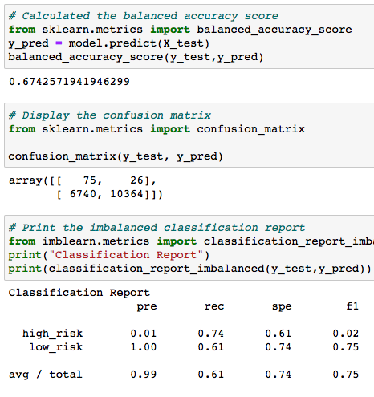
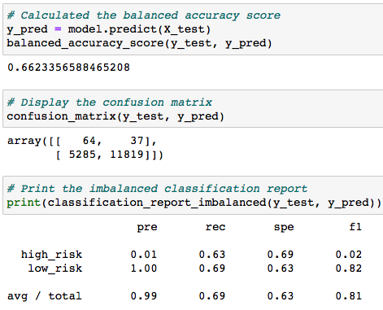
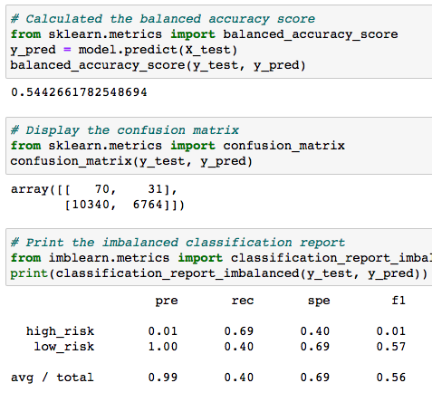
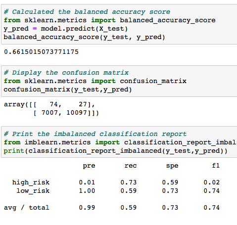
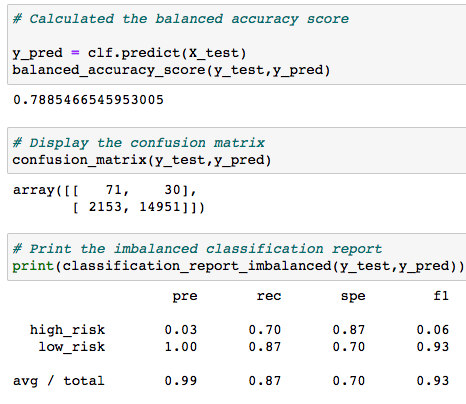
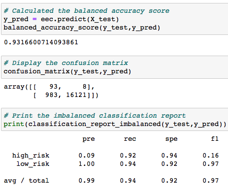

# Credit_Risk_Analysis

## Overview
The goal of this project is to use supervised machine learning algorithms to determine credit risks. 

Training and testing groups are created with the given data set, different techniques such as ensemble and resampling are used to balance the classification of the good loans and risky loans in the data analysis to improve model performance. 

Here we have used six algorithms, see below for the detailed results from each machine learning algorithm on their advantages and disadvantages. In the summary section, the best learning algorithm will be chosen for the credit risk analysis project with the dataset.

## Results
For each of the learning algorithms, balanced accuracy score, precision score, recall score are presented.

* Naive Random Oversampling algorithm

    - Balanced accuracy score: 0.67
    - Precision score: high_risk group is 0.01, low_risk group is 1
    - Recall score: high_risk group is 0.74, low_risk group is 0.61

    

* SMOTE algorithm

    - Balanced accuracy score: 0.66
    - Precision score: high_risk group is 0.01, low_risk group is 1
    - Recall score: high_risk group is 0.63, low_risk group is 0.69

    

* Cluster Centroids algorithm

    - Balanced accuracy score: 0.54
    - Precision score: high_risk group is 0.01, low_risk group is 1
    - Recall score: high_risk group is 0.69, low_risk group is 0.4

    

* SMOTEENN algorithm

    - Balanced accuracy score: 0.66
    - Precision score: high_risk group is 0.01, low_risk group is 1
    - Recall score: high_risk group is 0.73, low_risk group is 0.59

    

* Balanced Random Forest Classifier

    - Balanced accuracy score: 0.78
    - Precision score: high_risk group is 0.03, low_risk group is 1
    - Recall score: high_risk group is 0.7, low_risk group is 0.87

    

* Easy Ensemble AdaBoost Classifier

    - Balanced accuracy score: 0.93
    - Precision score: high_risk group is 0.09, low_risk group is 1
    - Recall score: high_risk group is 0.92, low_risk group is 0.94

    

## Summary
**Easy Ensemble AdaBoost Classifier** is the recommended model to apply to this project credit risk analysis. Cluster Centroids algorithm is the least recommended model since it has the lowest accuracy score of 0.54 percentage (among all the predictions, only 54% was correct).

Among all six models, the prediction scores on the high_risk and low_risk groups are dramatically different. For all the models, the low_risk precision is 1, which means that there were no incorrect predictions on low-risk credit records. Great! Therefore we can make sure there were no missed high-risk credit records, which is very important in real life. Then for the high_risk groups, precision is generally low, the higher the percentage, the less incorrectly identified high-risk records there are. In addition to Easy **Easy Ensemble AdaBoost Classifier** having the best result on high_risk precision scores, the model also has the highest balanced accuracy score of 93% and the highest f1 average score. That is why we recommended Easy Ensemble AdaBoost Classifier model in this Credit Risk Analysis project.